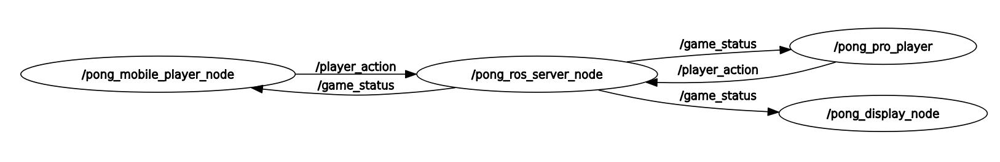

# PONG WS

The famous pong game with a twist of ROS2 and sensor data from phone. This project was created so that I could get familiar with ROS2. The pong logic was selected to make something fun while I learn new technologies.

## Architecture

The game is divided into ROS nodes, which implements smaller logical units. The nodes are communicating via ROS topics.

## Build from source

Open a terminal, clone the repo, then execute the `colcon build` command.

## Usage

Download and open [phyphox](https://phyphox.org/) for your smartphone. Select "Acceleration with g", start and enable remote access from the menu (Note that the remote URL will be shown on the screen).

Once the build command succeeded, then source the executables `source install/setup.bash`.

To run the game use the launch file: `ros2 launch launch/pong_launch.py`. Note, that inside the launch file you have to set the `phyphox_url` parameter according to your setup (the URL is written in the phyphox app when remote access enabled).

To start the game play, you have to send a 'new game request' to the server, that is done by executing the `ros2 topic pub --once /new_game_request std_msgs/msg/Empty` command in a terminal.

Enjoy :smile: